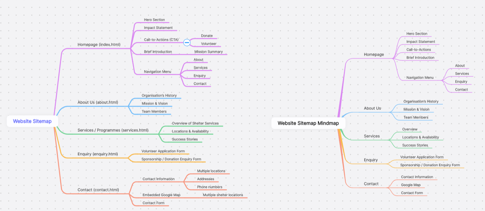

Web Development POE - ST10489659 / Yan Ritha Umumararungu Uwamariya 

Organisation Overview

The Haven Night Shelter is a registered non-profit organisation in South Africa dedicated to providing temporary shelter and support to homeless adults. With 15 shelters across Cape Town and surrounding areas, the organisation focuses on physical care, social services, personal development, and family reunification, aiming to transition clients from street life to stable homes.

Website Description – The Haven Night Shelter

The Haven Night Shelter website is a contemporary, flexible platform that aims to help and empower homeless people in Cape Town and the surrounding areas. It gives visitors clear information about the organization's goal, services, and shelter sites. The website accepts online donations, including recurring "Buy-a-Bed" sponsorships, and has a volunteer gateway for community interaction. The site engages visitors by demonstrating the organization's transparency and social effect through an interactive shelter map, impact dashboard, and story-driven content. Its user-friendly design, straightforward navigation, and multimedia integration make it simple for visitors to learn, contribute, and engage with The Haven's goal.

Document: 
https://advtechonline-my.sharepoint.com/:w:/g/personal/st10489659_vcconnect_edu_za/EaE0X3OZVVpPoj1nzRgrcCIBYO91QV2H0grgMvRdFxzLVg?e=jRBUgt

Sitemap - “Empowering the Nation” Website Sitemap 

(Boardmix, 2025)

Homepage (index.html) Hero Section Impact Statement Call-to-Actions (CTA): Donate / Volunteer Brief Introduction (Mission Summary) Navigation Menu About Us Services Enquiry Contact Us

About Us (about.html) Organisation’s History Mission & Vision Team Members

Services / Programmes (services.html) Overview of Shelter Services Locations & Availability Success Stories

Enquiry (enquiry.html) Volunteer Application Form Sponsorship / Donation Enquiry Form

Contact (contact.html) Contact Information (multiple locations with addresses & phone numbers) Embedded Google Map (showing multiple shelter locations) Contact Form

Reference: 
1.	The Haven Night Shelter – Official Website
2.	The Haven Night Shelter Annual Report 2023
3.	City of Cape Town News Release – Shelter Expansion
4. Boardmix, 2025. Untitled [online]. Available at: https://boardmix.com/app/share/CAE.CKTaoAEgASoQvhdsUwfyYzqNCTWfAkLPVzAGQAE/k9Rvtl [Accessed 26 August 2025].
